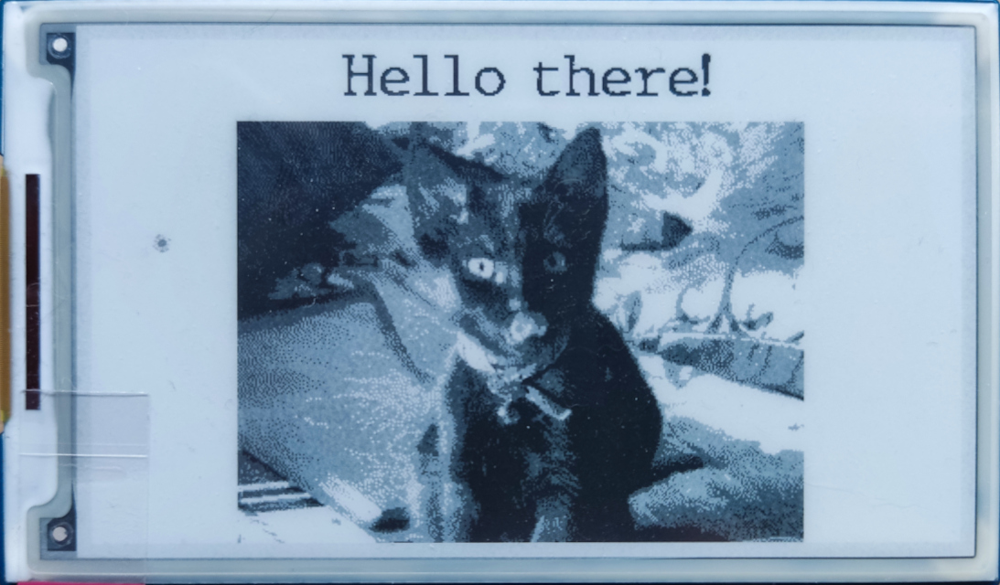

# Pico_ePaper

This module is a basic driver for Waveshare [Pico e-Paper 3.7 display](https://www.waveshare.com/wiki/Pico-ePaper-3.7).
It supports grayscale mode and allows setting screen rotation. Drawing routines are compatible with
[MicroPython FrameBuffer](https://docs.micropython.org/en/latest/library/framebuf.html) class, which means the same
method names and arguments they require (**blit()** being a slight exception - see below for details).

There are two classes in this module:
1. Eink - uses SPI for communication with the display, can be used with devices other than RP2040.
2. EinkPIO - uses one State Machine and DMA channel to communicate with the display.

Both classes offer the same functionality and the only difference is the optional parameters in the constructor they take.

---

## Note (Eink only)
**show()** method takes considerably longer for rotations 90 and 270, than 0 and 180 (~700 ms vs 80 ms). This is normal and
is a result of additional data processing required before sending buffers to the screen in landscape mode.
There's also a significant memory overhead associated with the processing.
Currently, I have no solution to this problem, except using EinkPIO whenever possible.

---

## Default pins
Both classes use the same default pin configuration:

| Signal      | Pin  |
| :---------- | :--- |
| SCK         | GP10 |
| MOSI        | GP11 |
| CS          | GP9  |
| DC          | GP8  |
| RST (reset) | GP12 |
| BUSY        | GP13 |

---

## Constructors
**Eink(rotation=0, spi=None, cs_pin=None, dc_pin=None, reset_pin=None, busy_pin=None, use_partial_buffer=False)**

**EinkPIO(rotation=0, sm_num=0, dma=5, cs_pin=None, dc_pin=None, reset_pin=None, busy_pin=None, use_partial_buffer=False)**

Constructors for these classes take multiple optional arguments that allow setting desired rotation as well as custom
pin assignments.

Accepted values for rotation are: 0, 90, 180 and 270. Supplying unaccepted value will result in an error. The default
value is 0, i.e. screen is horizontal with USB connector facing upwards.

**Eink** class takes additional _spi_ argument that allows setting custom SPI object to be used, if not set it defaults
to SPI(1, baudrate=20_000_000).

**EinkPIO** constructor takes two optional arguments:
1. _sm_num_ - sets which State Machine to use (valid values: 0-7, defaults to 0).
2. _dma_ - allows changing the DMA channel (defaults to 5).

By default, Pins setup reflects usage of the e-Paper display as a shield for Raspberry Pi Pico, but the user
can supply custom configuration for use with different boards and microcontrollers (tested with ESP-WROOM-32).

The optional parameter **use_partial_buffer** can be set to _True_ to use separate buffer for partial refreshes.
Otherwise, the BW buffer is used in partial mode.

---

## Public methods

___

### show(lut=0)
Sends current frame buffer to screen and start refresh cycle.

_lut_ - allows setting desire lookup table for this refresh (defaults to 0).
Incorrect setting can result in unexpected behaviour.

---

### sleep()
Puts display in sleep mode.

---

### partial_mode_on()
Enables partial updates mode.

---

### partial_mode_off()
Disables partial updates mode.

---

Additionally, the module supports all standard drawing methods found in FrameBuffer class:
1. fill(c=white)
2. pixel(x, y, c=black)
3. hline(x, y, w, c=black)
4. vline(x, y, h, c=black)
5. line(x1, y1, x2, y2, c=black)
6. rect(x, y, w, h, c=black, f=False)
7. ellipse(x, y, xr, yr, c=black, f=False, m=15)
8. poly(x, y, coords, c=black, f=False)
9. text(text, x, y, c=black)
10. blit(fbuf, x, y, key=-1, palette=None, ram=RAM_RBW)

---

## Note
**blit()** method takes one additional keyword argument compared to the one found in FrameBuffer class - _ram_ - that
specifies the target buffer (and consequently RAM) the source will be drawn into. There are three possible values:
1. RAM_BW - black pixels from source will be rendered in light gray on screen.
2. RAM_RED - black pixels from source will be rendered in dark gray on screen.
3. RAM_RBW - black pixels from source will be rendered in black on screen.

(For RAM_BW and RAM_RED respective pixels in the other buffer are assumed to be white.)

---

---
